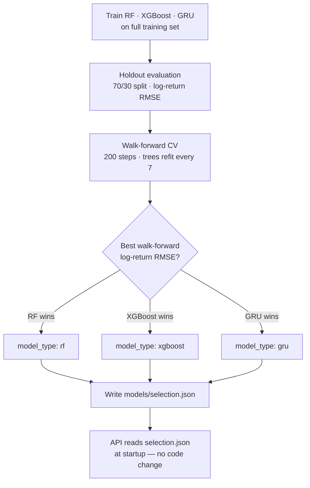
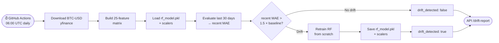
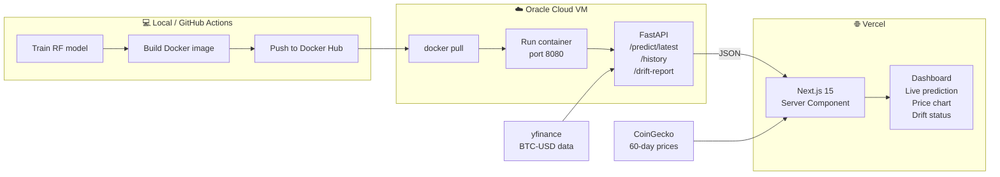

# BTC Price Predictor
## End-to-End ML on the Cloud

**Capstone Project — Ironhack Data Science & AI**

Bruno Pulheze · April 2026

> From raw data on Yahoo Finance to a live dashboard on Vercel,
> with automated retraining, drift monitoring, and Oracle Cloud deployment.

---

## Slide 0 — What is Bitcoin?

**Bitcoin (BTC)** is a decentralised digital currency — no bank, no government, no single point of control.

| | |
|---|---|
| Created | 2009 by the pseudonymous **Satoshi Nakamoto** |
| Supply cap | **21 million BTC** — hardcoded, cannot be changed |
| How it works | Transactions recorded on a public ledger: the **blockchain** |
| How new BTC is created | **Mining** — computers compete to solve cryptographic puzzles |
| Why people care | Store of value, global transfers without intermediaries, speculative asset |

### Why is the price so volatile?
- Small market relative to gold or equities → large orders move the price
- Sentiment-driven (news, regulation, influencers)
- No intrinsic cashflow to anchor valuation to

> Bitcoin went from **$0.01** in 2009 to an all-time high above **$100,000** in 2024.
> That volatility is exactly what makes price prediction both hard and interesting.

---

## Slide 1 — What We Built

**Goal:** Predict the next-day Bitcoin closing price and serve it as a live API.

### Full Stack

| Layer | Technology |
|---|---|
| Data | Yahoo Finance via `yfinance` (~4,200 daily closes since 2014) |
| Training | scikit-learn · XGBoost · Keras GRU (comparison) |
| Experiment tracking | **MLflow** — SQLite backend |
| API | **FastAPI** + uvicorn |
| Container | **Docker** → Docker Hub |
| Cloud VM | **Oracle Cloud Infrastructure** — Always Free ARM instance |
| CI/CD + retraining | **GitHub Actions** — daily cron + manual trigger |
| Dashboard | **Next.js 15** + Recharts → deployed on **Vercel** |

---

## Slide 2 — Lesson Learned: Price-Space Was a Trap

### First approach — predict the raw closing price

A model that simply outputs **"tomorrow ≈ today"** achieves an R² of ~0.99 in price-space.
This is not skill — it is just persistence. The numbers look great; the model is useless.

```
Persistence:  price[t+1] = price[t]   →  price-space RMSE ≈ $800
A model that predicts "no change" every day can match this trivially.
```

### The fix — predict log-returns instead

$$\text{target} = \log\!\left(\frac{\text{close}[t]}{\text{close}[t-1]}\right)$$

- Centered around **zero** — the model must learn real signal, not just copy yesterday's price
- **Stationary** — no extrapolation failures when Bitcoin reaches new all-time highs
- **Honest baseline** — persistence predicts log-return = 0 every day (RMSE ≈ σ of returns ≈ 0.038)
- Price is recovered at serving time: `price[t+1] = price[t] × exp(predicted_return)`

> Any model that cannot beat the persistence baseline in log-return space has learned nothing useful.

---

## Slide 3 — Model Comparison

Three candidates trained on **25 features**, evaluated in **log-return space**.

### Features (25 total — all shifted by 1 day, no lookahead)

`lag_1 … lag_20` (closing prices) · `std30` · `rsi14` · `macd` · `macd_sig` · `return`

### Holdout results (70/30 split)

| Model | RMSE | MAE | R² | Dir Acc |
|---|---|---|---|---|
| RF | 0.03660 | 0.02908 | −1.17 | 52.8% |
| XGBoost | 0.03059 | 0.02296 | −0.52 | 49.7% |
| GRU | 0.02542 | 0.01808 | −0.05 | 49.4% |
| Persistence baseline | ~0.038 | — | 0 | 50% |

### Walk-forward CV (200 steps, trees refit every 7 steps — more realistic)

| Model | RMSE | MAE | Dir Acc |
|---|---|---|---|
| **RF** | **0.00159** | **0.00088** | **95.5%** ✓ |
| GRU | 0.00197 | 0.00177 | 32.5% |
| XGBoost | 0.00502 | 0.00142 | 93.5% |

**Random Forest** wins walk-forward CV: lowest RMSE and highest directional accuracy.
GRU had better holdout metrics but failed to generalize in the sequential simulation.

---

## Slide 4 — MLflow & Model Selection

### Experiment tracking with MLflow

Every training run logs:
- Hyperparameters: `n_estimators`, feature list, train/test split date
- Metrics: `logret_rmse`, `logret_mae`, `R²`, `dir_acc`
- Artifacts: model file, scalers

```bash
mlflow ui   # SQLite backend at mlflow/mlflow.db → http://localhost:5000
```

### Selection logic (`src/training/compare_models.py`)

The best model is chosen by **walk-forward log-return RMSE** (not price-space RMSE).
Result written to `models/selection.json` — the single source of truth for the API.

```json
{
  "model_type": "rf",
  "logret_rmse": 0.02787,
  "rmse": 1917.52,
  "persistence_rmse": 1716.76,
  "features": ["lag_1", ..., "lag_20", "std30", "rsi14", "macd", "macd_sig", "return"]
}
```

> `selection.json` decouples training from serving: the API loads whatever model
> is recorded there without any code change.



---

## Slide 5 — Automated Retraining & Drift Monitoring

### Daily GitHub Actions cron (`06:00 UTC`)



### Drift report (visible on dashboard)

```json
{
  "available": true,
  "drifted": false,
  "recent_mae": 1423.50,
  "baseline_rmse": 1716.76,
  "drift_threshold": 2575.14
}
```

Force retrain anytime:

```bash
python src/training/retrain.py --force
# or: GitHub Actions → Run workflow → force_retrain=true
```

---

## Slide 6 — Deployment: Docker → Oracle Cloud → Vercel



### Oracle Cloud Infrastructure — Always Free tier

- **Instance:** `VM.Standard.A1.Flex` — ARM Ampere, 1 OCPU, 6 GB RAM, permanently free
- **Live API:** `http://138.2.180.250:8080`
- Endpoints: `GET /`, `GET /health`, `GET /predict/latest`, `POST /predict`, `GET /history`

### Vercel dashboard

- **Next.js 15** App Router — server component fetches API + CoinGecko in parallel
- **ISR** (revalidate = 1800 s) — fresh data every 30 min without full rebuild
- Displays: 60-day / full history chart · next-day prediction · drift monitoring card · model metadata

---

## Slide 7 — Conclusion

### What this project demonstrates

| Principle | In practice |
|---|---|
| Honest evaluation | Log-return space · walk-forward CV exposed GRU's false advantage |
| Experiment tracking | MLflow — every run logged, model selection reproducible |
| Clean serving layer | `selection.json` decouples model from code — zero-change swap |
| Containerization | Docker — same environment locally, in CI, and on the cloud |
| Automated operations | Daily drift detection + conditional retraining, no human needed |
| Live product | Oracle Cloud API + Vercel dashboard — both publicly accessible |

### Key takeaway

Evaluation protocol matters as much as model choice — walk-forward CV and log-return space revealed the true winner.

### Next steps

- **Richer features** — on-chain metrics (active addresses, miner fees), sentiment from news/social, macro indicators (DXY, S&P 500 correlation)
- **Better model** — LightGBM with Bayesian hyperparameter search; Temporal Fusion Transformer for multi-horizon forecasting
- **HTTPS + auth** — TLS certificate via Let's Encrypt; API key protection
- **Full CD pipeline** — auto-rebuild Docker image and redeploy VM after every successful retrain
- **Alerting** — Slack/email notification when drift is detected or prediction error spikes

### Links

- **Live API:** `http://138.2.180.250:8080/predict/latest`
- **Dashboard:** [Vercel deployment]
- **Code:** `github.com/brunopulheze/capstone-ml-on-cloud`


